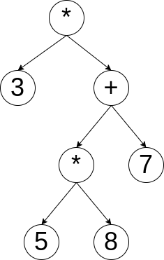
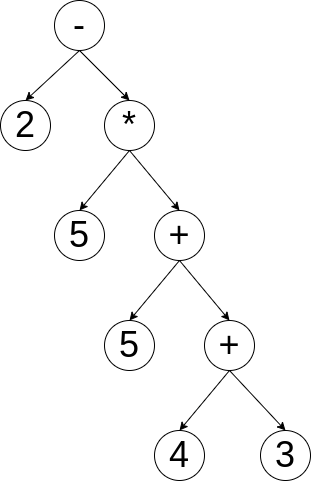

# RPN Dojo

Binary tree implementation of [Reverse Polish Notation](https://codingdojo.org/kata/RPN/)

Note : only binary operators work with current implementation.

## How it works

The algorithm parses the string and constructs an array with it. The array is then reversed, and the first index is necessary an operator.
It then creates a tree with itself as data and next array index as right leef, and second next as left leef. If the array index is an operator,
it does a recursive call.

Once the tree is complete, a prefix path reading is done to do the computation.

(See [this](http://aqualonne.free.fr/dossiers/algo/c08.gif) for reference)

Below are examples of trees.

## Examples

#### Example 1

 ```
 3 5 8 * 7 + *
 ```



```
3 * ((5 * 8) + 7) = 141
```


#### Example 2

 ```
2 5 5 4 3 + + * -
 ```



```
2 - (5 * (5 + (4 + 3))) = -58
```
